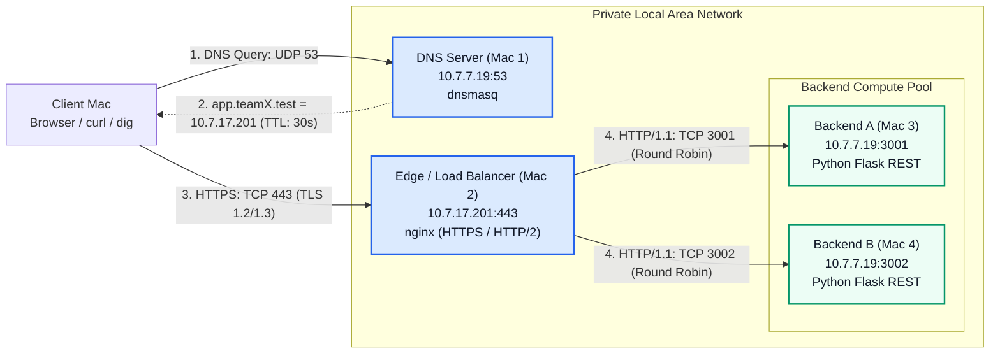

# Private Network Service Platform

Phase 1 implementation of a private, secure, and load-balanced network platform designed for the Computer Networks course project.

The platform demonstrates a complete, isolated private request pipeline:
1. **Private Name Resolution:** Client queries a private DNS server (`dnsmasq`) for `app.teamX.test` with a custom TTL.
2. **Secure Transport (TLS):** Client negotiates a trusted HTTPS connection (`TLS 1.2 / 1.3` over TCP port 443) using local PKI / certificate trust.
3. **Reverse Proxy & Load Balancing:** `nginx` edge terminates TLS and distributes requests across multiple Python REST backends using round-robin balancing.
4. **Caching & Conditional Requests:** HTTP caching mechanisms (`Cache-Control: max-age=60`, `ETag`, and `304 Not Modified`).
5. **Packet Inspection & Forensics:** Detailed Wireshark packet captures (`.pcapng`) analyzing DNS, TCP 3-way handshake, and TLS session records.

---

## Project members

| Name | Enrollment | Work mode | Role & Responsibilities |
| --- | --- | --- | --- |
| **Antik Mondal** | 2401010084 | Team (Lead) | Project Lead, 2 Backend Servers on Mac (Port 3001 & 3002), Wireshark Forensics |
| **Vansh Panwar** | 2401010494 | Team | Edge Reverse Proxy & Nginx TLS/HTTPS Load Balancer Setup |
| **Tanmay Singh** | 2401010476 | Team | Private DNS Server (`dnsmasq`) Setup & Domain Mapping |

---

## Architecture



---

## Network Inventory

| Node | Member & Role | Address & Port | Service | Protocol Layer |
| --- | --- | --- | --- | --- |
| **Mac 1** | Tanmay Singh (`2401010476`) — Primary DNS | `10.7.7.19:53` | `dnsmasq` | Application (UDP/TCP 53) |
| **Mac 2** | Vansh Panwar (`2401010494`) — Edge & Load Balancer | `10.7.17.201:443` | `nginx` | Presentation / Transport (TLS / TCP 443) |
| **Mac 3** | Antik Mondal (`2401010084`) — Backend A | `10.7.7.19:3001` | Python REST API | Application (HTTP/1.1) |
| **Mac 4** | Antik Mondal (`2401010084`) — Backend B | `10.7.7.19:3002` | Python REST API | Application (HTTP/1.1) |

---

## Repository Structure

```text
.
├── README.md                      # Main project guide & architecture overview
├── docs/                          # In-depth technical documentation
│   ├── architecture.md            # Topology, sequence diagrams, and protocol stack
│   ├── demo-commands.md           # Step-by-step command sequence for demonstrations
│   ├── form-submission-checklist.md # Rubric mapping for evaluation sections A-D
│   ├── phase1-video-script.md     # 5-minute timed video demonstration script
│   └── tls-setup.md               # Certificate generation and macOS Keychain trust
├── evidence/
│   └── phase1/                    # Verification artifacts
│       ├── README.md              # Wireshark packet breakdown and filter guide
│       ├── demo-command-output.md # Saved command logs from live system
│       ├── screenshots/           # Packet inspection screenshots
│       │   ├── dns-query-response.png
│       │   ├── dns-answer-details.png
│       │   ├── tcp-three-way-handshake.png
│       │   └── tls-stream-overview.png
│       ├── phase1-dns-tcp-tls.pcapng          # Clean filtered capture
│       └── phase1-original-live-capture.pcapng # Full live capture
├── backend/                       # Python Flask service
│   ├── app.py                     # REST endpoints (/api/status, /api/cache)
│   └── requirements.txt
├── nginx/                         # Reverse proxy configuration
│   └── nginx.conf.template
├── dnsmasq/                       # Private DNS configuration
│   └── dnsmasq.conf.template
├── scripts/                       # Automation scripts
│   ├── get-my-ip.sh
│   ├── run-backend.sh
│   └── smoke-test.sh
└── team/
    ├── team.env.example
    └── team.env                   # Session IP configuration
```

---

## Quick Verification

### 1. Private DNS Lookup
```bash
dig @10.7.7.19 app.teamX.test
```

### 2. Direct Backend Health Check
```bash
curl -i http://10.7.7.19:3001/api/status
curl -i http://10.7.7.19:3002/api/status
```

### 3. Edge HTTPS & Load Balancing
```bash
curl -v https://app.teamX.test/api/status
curl --http1.1 -I https://app.teamX.test/api/status
curl --http2 -I https://app.teamX.test/api/status
```

### 4. HTTP Caching & ETag Validation
```bash
curl -I https://app.teamX.test/api/cache
curl -i -H 'If-None-Match: "cn-cache-v1"' https://app.teamX.test/api/cache
```

---

## Detailed Documentation Links

- [Project Playbook, Troubleshooting & Runbook](docs/project-playbook-and-troubleshooting.md)
- [Architecture & Sequence Details](docs/architecture.md)
- [Demonstration Commands & Walkthrough](docs/demo-commands.md)
- [Form Submission & Rubric Checklist](docs/form-submission-checklist.md)
- [5-Minute Video Recording Script](docs/phase1-video-script.md)
- [TLS & Keychain Trust Guide](docs/tls-setup.md)
- [Wireshark Evidence & Packet Guide](evidence/phase1/README.md)
